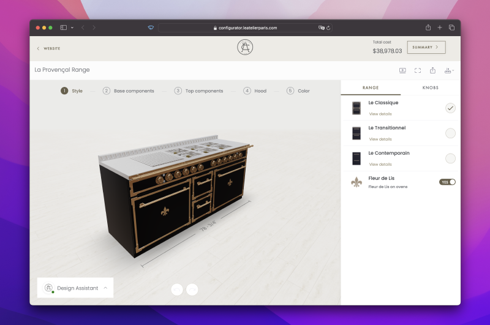
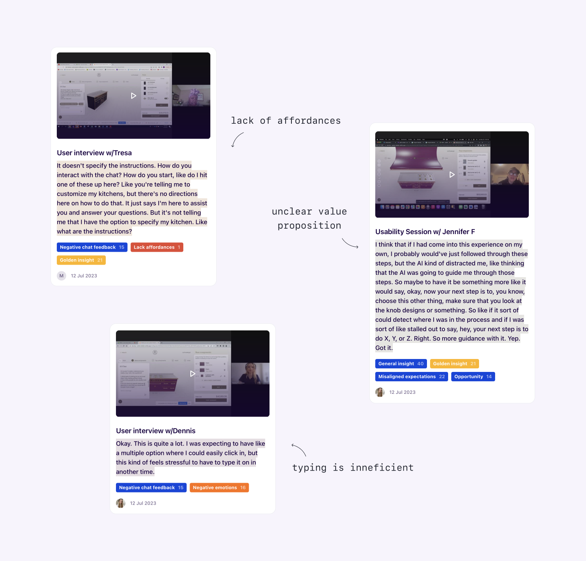
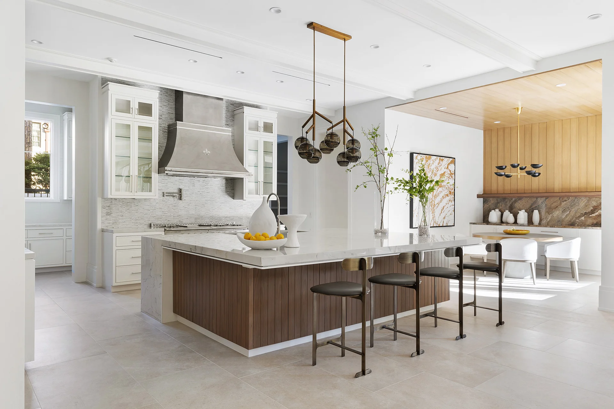
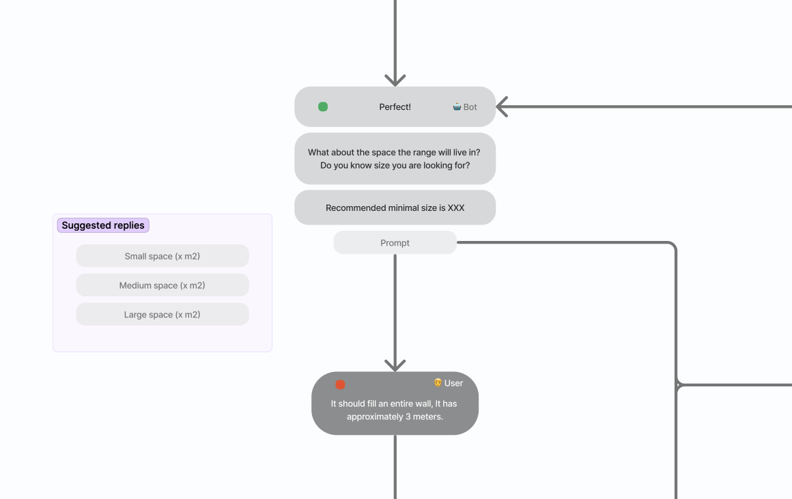

In the midst of the AI gold rush, the agency I worked in found itself in a transition phase. We aimed to shift from offering design and development services to developing and licensing our own product. This sparked a new direction, driven by the idea of creating AI-powered creator tools.

My team was tasked to reimagine the online shopping experience of custom-made or customizable products, through conversation. This is what we learned from our early experiments, using AI to help users create unique products online.

## Why custom products?

The agency had built a few 3D product configurators for clients. These tools simplify the sales process for companies selling customizable products, such as kitchen ranges, garage cabinets or made-to-order pillows, by allowing users to specify their preferences online.

The agency had built a few 3D product configurators for clients. These tools simplify the sales process for companies selling customizable products, such as kitchen ranges, garage cabinets or made-to-order pillows, by allowing users to specify their preferences online.



```
– Example of a kitchen configurator
```

However, feedback from clients indicated that these configurators were too complex and difficult to use. We needed a solution.

This case study covers our first AI implementations in the kitchen configurator for L’Atelier Paris. During this partnership, we explored ways in which to use this new technology to improve the online configuration experience. Our goal was to learn from this initiative to inform the product direction.

## How it started

Our CEO hypothesized that using a conversational interface would simplify the experience. At this stage we didn't know if it would be possible to integrate a LLM (Large Language Model) in the context of 3D product configurators. My team created a basic chatbot for the kitchen configurator. We then asked users interact with it and customize various aspects of their kitchen range

<video autoplay muted playsinline loop>
<source src="poc.mp4" type="video/mp4">
</video>

```
– Proof of concept: configuring using natural language
````

These were the main findings from usability testing:
> ### ⚡Insights
>
> - Users had negative perceptions of chatbots.
> - The chat interface lacked clarity and affordances.
> - The value proposition wasn't clear.
> - Some users were impressed by the functionality.
> - There were mixed feelings, including excitement and fear, towards AI.



```
– A few examples from usability testing
````

## Creating a desirable experience

Following the proof of concept, our aim was to develop a desirable AI experience, starting with the kitchen configurator.
Simplifying the experience was crucial since our primary users were older, wealthy Americans. Additionally, architects and designers at physical showrooms used the tool to create quick proposals during client appointments.



```
– Example of a kitchen built by L'Atelier
```

## Simulating a Sales Representative

We conducted a workshop with key stakeholders, aiming to better understand the offline sales process. The outcome was a hypothesis: simulating a sales representative would assist users in creating their dream kitchen. We wanted to replicate the initial conversation customers might have at a physical showroom.


```
– Example of a conversation flow, created to inform the behaviour and goals of the AI assistant
```

To test this, I created realistic prototypes where test subjects could type their answers. Sophie, our virtual sales representative, asked them four questions to gather requirements and create an initial recommendation.

<video autoplay muted playsinline loop>
<source src="discovery.mp4" type="video/mp4">
</video>

```
– A prototype I created to test generating the initial product recommendation
```

# What we learned

Despite numerous iterations, we consistently found:

> ### ⚡Insights
>
> - Users preferred conventional interfaces.
> - They wanted to interact with the product.
> - Text input was inefficient.
> - Users desired control.
> - The chat experience lacked affordances.


```
– The main insight shared by our UX researcher
```

## Finding purpose

Based on these findings, we aligned with stakeholders. We agreed that the AI capabilities would be best utilized for generating recommendations, answering questions, and assisting users as needed. We shifted away from a fully guided design process and focused on providing value at key moments.

## Next steps

For the initial release, we simplified the interaction with the virtual sales representative, Sophie, to a single dialog. Users could choose to design independently, seek help from Sophie, or use text input for a starting point. We planned to gather real data to inform further decisions.

In the meantime, we continued exploring more contextual approaches that would better integrate into the whole design experience. The first results from unmoderated testing looked very promising - for the first time in usability testing, we saw people intuitively interact with the AI feature and ask questions about the product. We'll be exploring this direction further.

<video class="image" autoplay muted playsinline loop>
<source src="hybrid.mp4" type="video/mp4">
</video>

```
– A prototype I created to test a contextual approach.
As the user navigates, the suggestions
adapt to their actions.
```
