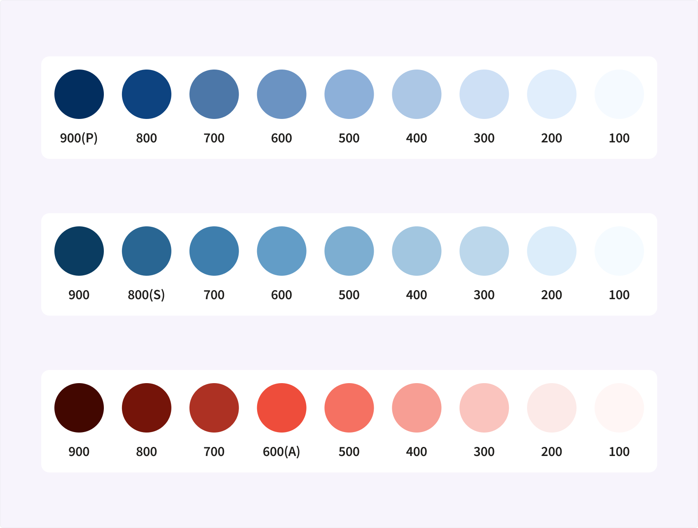
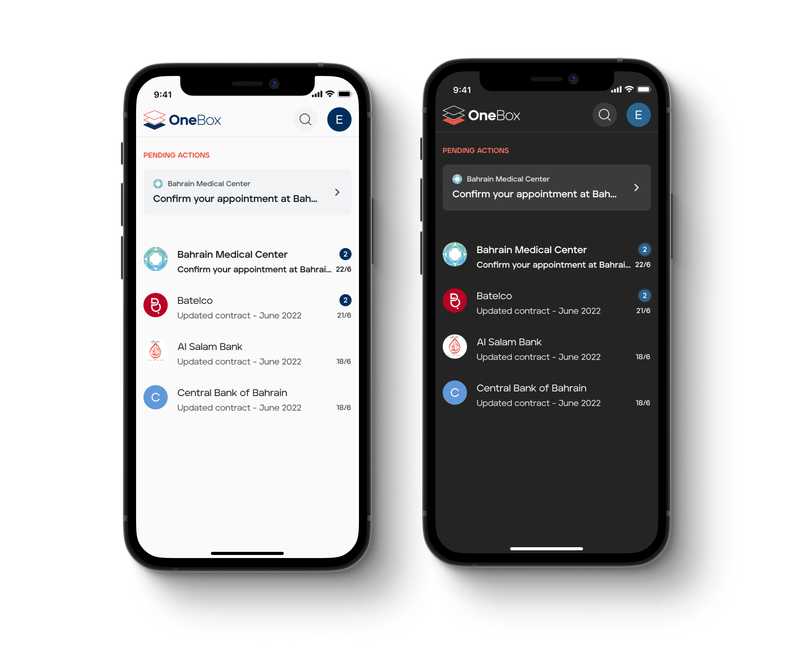

Small teams on client projects don’t get much support to create and maintain design systems. Often a single designer defines the level of detail for a system based on the type of project, budget, and timeline. Decisions made early in the project with limited information can cause issues later on. Sometimes, the only solution is to reassess and choose a different approach.

When I joined this project, our team faced such challenges. There were two small teams working on different products and sharing a design library. Both products were in their early stages, gearing up to launch an MVP for the mobile app. I joined the team working on a secure communication platform, while the other team developed a digital ID solution.

## The problem

Inconsistencies started popping up across the different products. The existing color system was too flexible, making it hard for different designers to agree on how to use colors. Developers struggled to maintain color consistency, leading to inefficiencies in the design and development processes. To add to the challenge, we received a new requirement to support theming.

## Process

To tackle these issues, I met with the front-end developers. We decided to shift towards a semantic way of naming colors. This meant using names like "background primary" instead of intrinsic properties like hue and lightness.

I began by examining how colors were used in the designs. I generated a range of shades based on the colors in the library and used them as tokens for the semantic style definitions. Working closely with the development team, I gathered feedback and refined the new naming proposal.



```
- Shades created from the brand colors
```


```
- Example of the semantic style definitions
```

After updating the color styles in the library, I added brief descriptions of how colors were used. This documentation enabled other designers to quickly understand the system and its usage. I also documented the process of generating new styles.

## Challenges

The goal of this initiative was to create a system that would improve the workflow and collaboration of the team while being simple and easy to maintain. This meant defining the least amount of styles, which inevitably resulted in more dependencies between styles. This was a compromise, but it still resulted in a more consistent color system, better collaboration across different teams, and easy support for theming.



```
- Example of a dark theme using the new system
```

## Results

Naming the colors according to their usage made it easier for designers and developers to understand how to use them. It made it possible to support theming by simply replacing the color values without the need to update naming.

The semantic system increased consistency across multiple products, improved usability of the design library, and made it easier for the design and development teams to collaborate more effectively.