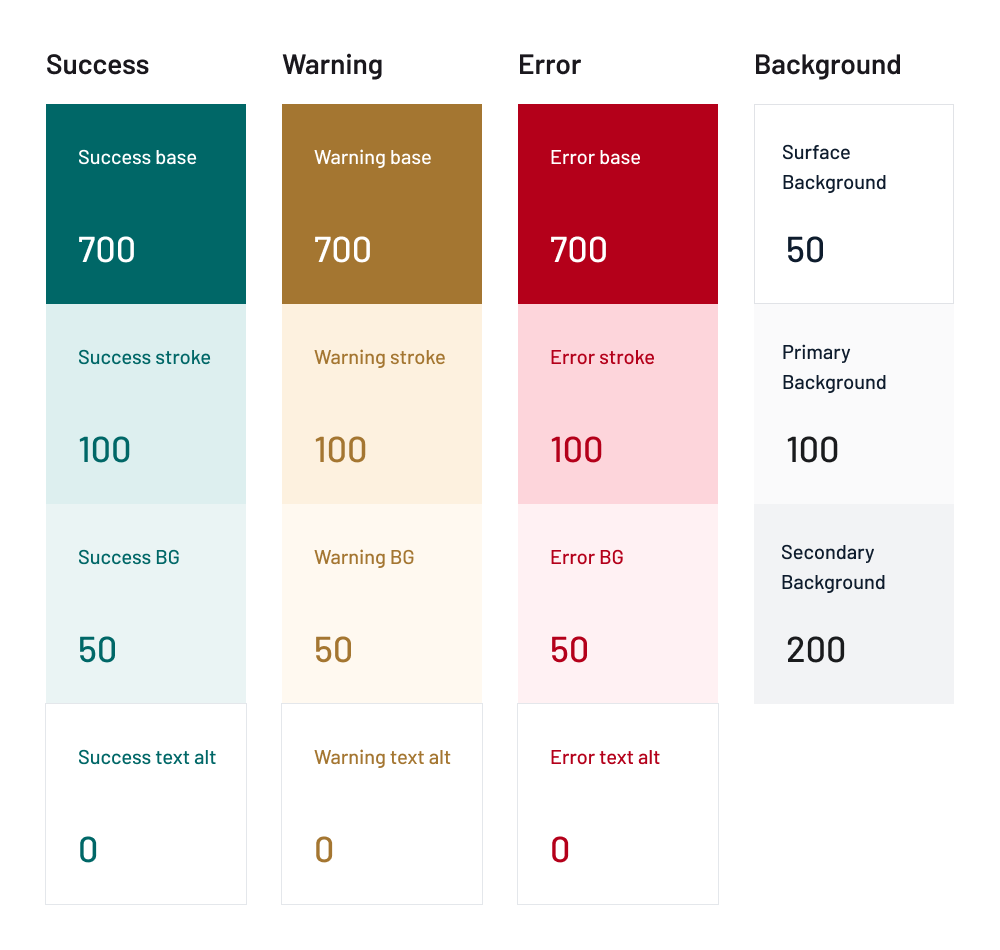

## Overview

OneBox offers a secure communication channel between governments and citizens and OneID provides a digital ID solution. We created an MVP for these two products, sharing the same design library.


```
- OneBox mobile app
```

## Intro

Color inconsistencies across the products and the added challenge to support theming, lead us to rethink color naming. The previous system named colors based on intrinsic properties such as hue and lightness. This provided no guardrails on how to use them and resulted in inefficiencies in the design and development processes.

## Challenge

Create a color naming system that would improve the workflow and collaboration within the team while being simple and easy to maintain.

## Process

We decided to shift towards a semantic way of naming colors. This meant using names that refer to function, such as "background primary", instead of intrinsic properties like hue and lightness.

I generated a range of shades based on the colors in the library and used them as tokens for the semantic style definitions. Working closely with the development team, I gathered feedback and refined the new naming proposal.


```
- Shades created from the brand colors
```



```
- Example of the semantic style definitions
```

After updating the color styles in the library, I added brief descriptions of how colors were used. This documentation enabled other designers to quickly understand the system and its usage. I also documented the process of generating new styles.

![[figma-doc.webp]]

```
- Color documentation in Figma
```

## Results

Naming the colors according to their usage made it easier for designers and developers to understand how to use them. It made it possible to support theming by simply replacing the color values without the need to update naming.

The semantic system increased consistency across multiple products, improved usability of the design library, and made it easier for the design and development teams to collaborate more effectively.


```
- Example of a dark theme using the new system
```
