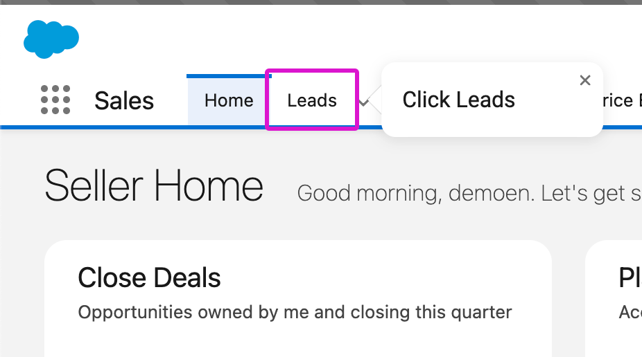
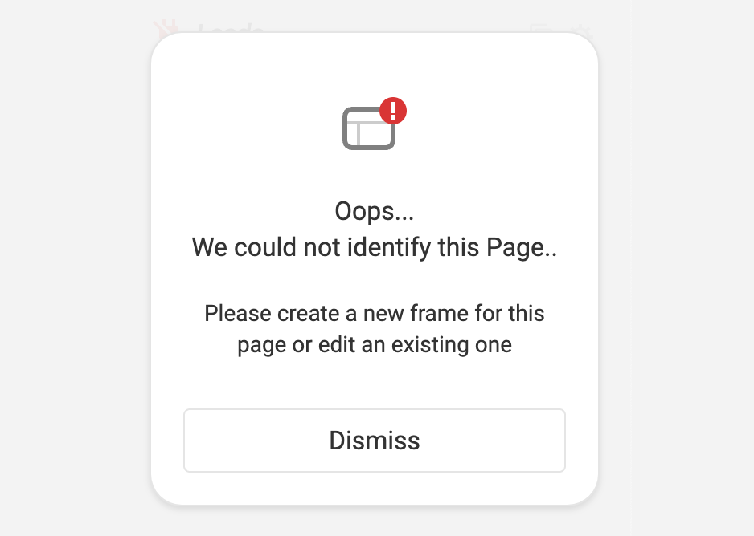
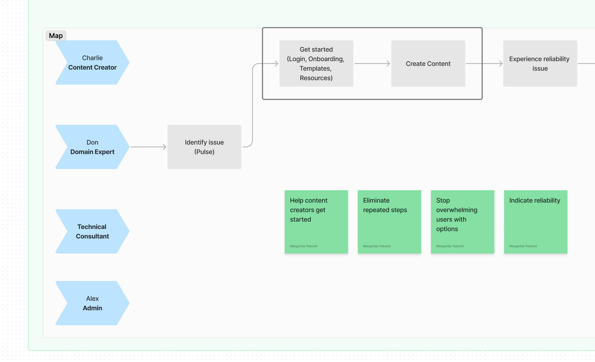
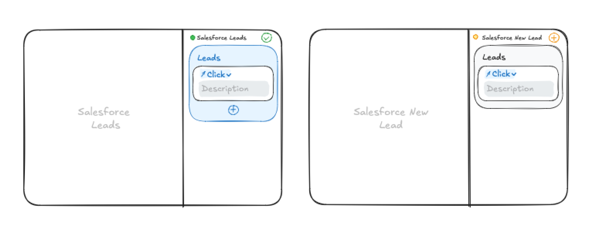

## Overview

Apty is a digital adoption platform that offers an interactive experience primarily to help enterprise customers onboard new users and help them learn new processes.



```
– Example workflow in Salesforce
```

## Intro

Apty's existing solution relied heavily on identifying elements in the page of host applications running in the browser. This was very fragile and susceptible to break whenever changes were made to the page.
Content creators were already spending significant time to manually map every process in their organizations. Content breaking all the time and the fact that they had no idea how to fix it, resulted in a lot of frustration.



```
– Error state due to technical limitations of element selection
```

## Challenge

Create a solution for non-technical users to be able to create and manage content more reliably.

## Process

I lead a design sprint with our client (CEO and Product Manager) and our tech lead. The result was a rough concept leveraging LLM (Large Language Model) and didn't rely on element selection.



```
– Design Sprint map
```

After the workshop, I worked closely with the tech lead to shape the idea into a proof of concept to pitch to our client.



```
– Initial concept sketches 
```


