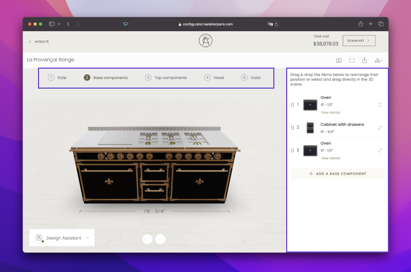
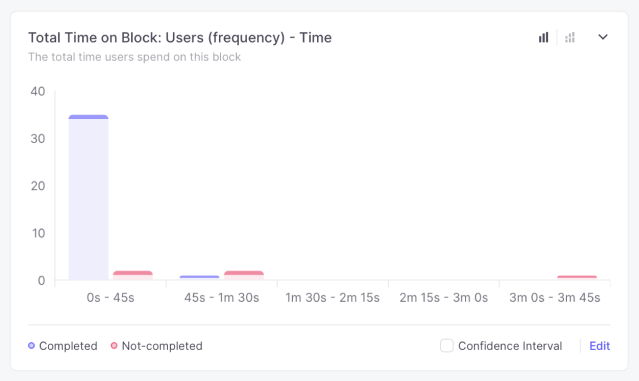
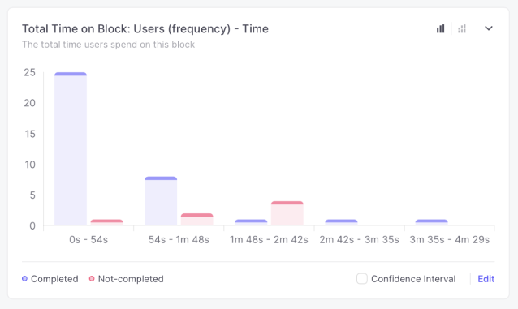

Online 3D product configurators are tools used to customize products like kitchens, garage cabinets, furniture, and jewellery. These products can have lots of customizable parts and rules for arranging them. The more complex the product, the harder it is to make an intuitive experience.


```
- Example of a configurator built for L'Atelier Paris
```

## Context

We received feedback from multiple clients that the configurators we built were too complex and hard to use. Additionally, the mobile experience wasn't given much thought initially. Everything was built on the assumption that configuring complex products would be easier on larger screens. However, many users were accessing these configurators on mobile first. For instance, for L'Atelier's kitchen configurator, 60% of traffic came from mobile devices.

## Goal

We wanted to rethink the mobile experience of configurators. I was tasked with redesigning the L'Atelier kitchen configurator on mobile. The goal was to create a scalable solution that could be applied to other configurators.

## Kitchen Configurator

Analyzing the kitchen configurator, I identified the main issues:

> ### ⚡️ *Main Issues*
>
> - Information architecture
> - Navigation pattern
> - Cognitive load

The design assumed a linear path to create the kitchen design, starting with the style, then editing the base, and so on. However, during usability testing, users tended to jump between sections and follow unique paths. Another issue was that the configuration list was often mistaken for a menu of elements to add to the range. Users expected those elements to be added to their configuration upon clicking them



```
- Image showing the main issues: steps navigation and configuration list
```

Options like tabs were often overlooked, as well as the ability to adjust cabinet size, which was one of our client's unique selling points.

On mobile, usability testing showed the configurator was practically unusable due to overwhelming information, small clickable elements, and impractical interactions with the model.

```
- Image showing the cluttered UI on mobile
```

## Redesign goals

The goal was to simplify and reduce the initial amount of information presented. This would make it easier to process available actions while allowing users to choose their own path.

Improving navigation and choosing scalable patterns for both large and small screens were the main priorities. I also aimed to bring more focus to the product, in this case the kitchen range, by promoting direct interactions and manipulation of the model.

# Validation

I proposed the following design, and, together with the UX Researcher, we planned an unmoderated test to compare it with the production version.

<video style="width: 300px; border-radius: 50px;" autoplay muted playsinline loop>
<source src="mobileNew.mp4" type="video/mp4">
</video>

```
– The mobile redesign
```

## What we learned

The new design outperformed the old one in almost every task except one: changing colors, which we had anticipated might be a challenge due to the model being hidden. These results confirmed our progress, and we planned further improvements.



```
- Time it took to complete one of the tasks with the new design
```



```
- Time it took to complete the same task with the old design
```

## Further Improvements

We improved the designs based on the research results. We made it possible to view the model while changing options that affect its visual appearance such as color and style.

## Learnings

By adopting a more modular approach and grouping available actions, we significantly simplified the experience and reduced cognitive load. Iterating on this approach led to a more efficient design, not only in terms of space usage but also usability. During unmoderated testing, the redesign reduced average time on task by 31%. Task completion only improved by 1%, but it was already pretty high at 83% completion rate on average.

## Going live

Next, we'll be going live and plan to measure performance in production to validate improvements and identify areas that need additional work.