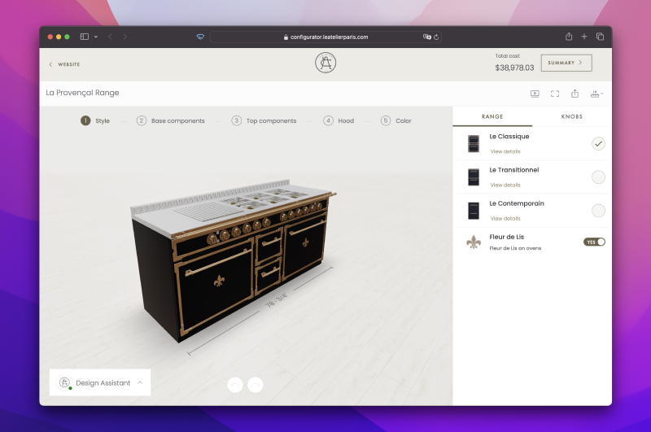
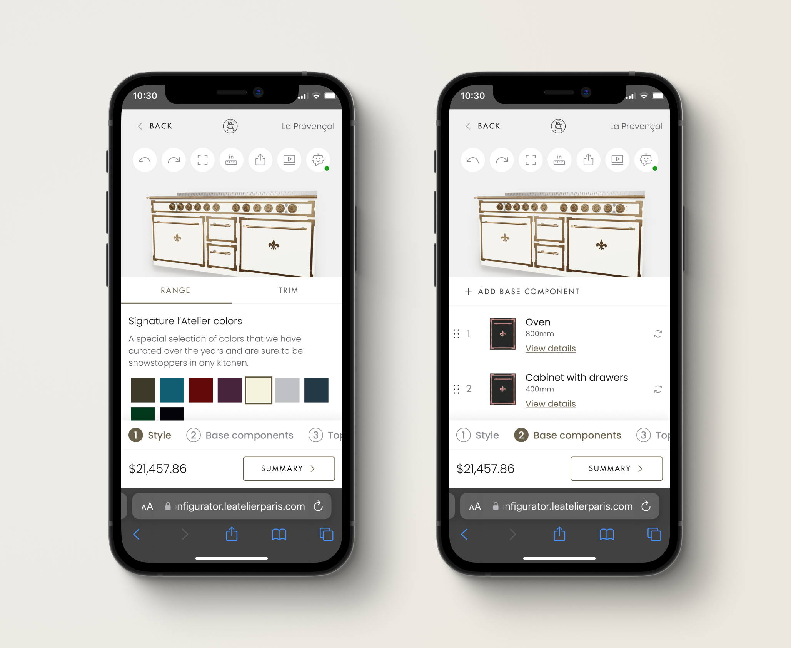

## Overview

Online 3D product configurators are tools used to customize products like kitchens, garage cabinets, furniture, and jewelry. These products can have lots of customizable parts and rules for arranging them. The more complex the product, the harder it is to make an intuitive product configuration experience.



```
- Example of a configurator built for L'Atelier Paris
```

## Intro

We received feedback from multiple clients that the configurators we built were too complex and hard to use. Everything was built on the assumption that configuring complex products would be easier on larger screens. However, many users were accessing these configurators on mobile. For instance, on L'Atelier's kitchen configurator, 60% of traffic came from mobile devices.

## Challenge

Rethink the mobile experience of configurators, starting with the redesign of the L'Atelier kitchen configurator. The goal was to create a scalable solution that could be applied to other configurators.

## Process

I started by analyzing the kitchen configurator and reviewing data from previous usability testing. I identified a few core issues:

> ### ⚡️ *Main Issues*
>
> - Confusion around how information was structured and grouped 
> - Stepped navigation pattern didn't match user's behavior 
> - Overall clutter and increased cognitive load

On mobile, usability testing showed the configurator was practically unusable due to overwhelming information, small clickable elements, and impractical interactions with the model.



```
- Image showing the cluttered UI on mobile
```


My goals for the redesign were to reduce the initial amount of information presented to users, improve the navigation and use scalable design patterns that adapt to larger and smaller screens. I also aimed to bring more focus to the product, in this case the kitchen range, by promoting direct interactions and manipulation of the model.

# Solution

I proposed the following design. Together with the UX Researcher, we planned an unmoderated usability test to compare the new design with the version in production.

<video style="width: 300px; border-radius: 50px;" autoplay muted playsinline loop>
<source src="mobileNew.mp4" type="video/mp4">
</video>

```
– The mobile redesign
```

## What we learned

The new design outperformed the old one in almost every task except one: changing colors. We had anticipated this might be a challenge due to the model being hidden. These results confirmed our progress, and we planned further improvements.


```
- Time it took to complete one of the tasks with the new design
```


```
- Time it took to complete the same task with the old design
```

## Further Improvements

We planned further improvements based on the research results. The main change was to make it possible to view the model while changing styling options such as color and style.

## Learnings

By adopting a more modular approach and grouping available actions, we significantly simplified the experience and reduced cognitive load. Iterating on this approach led to a more efficient design, not only in terms of space usage but also usability. During unmoderated testing, the redesign reduced average time on task by 31%. Task completion only improved by 1%, but it was already pretty high at 83% completion rate on average.
