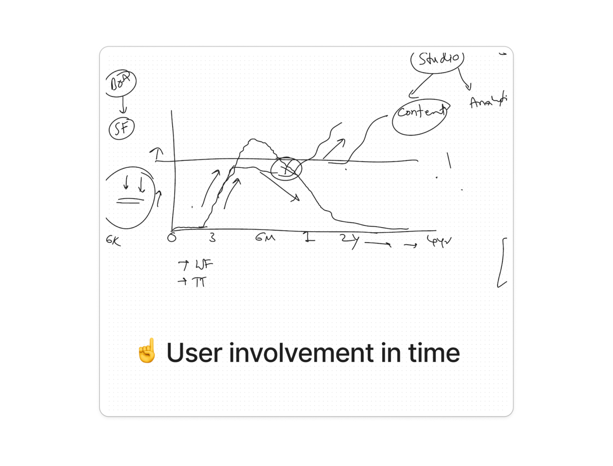
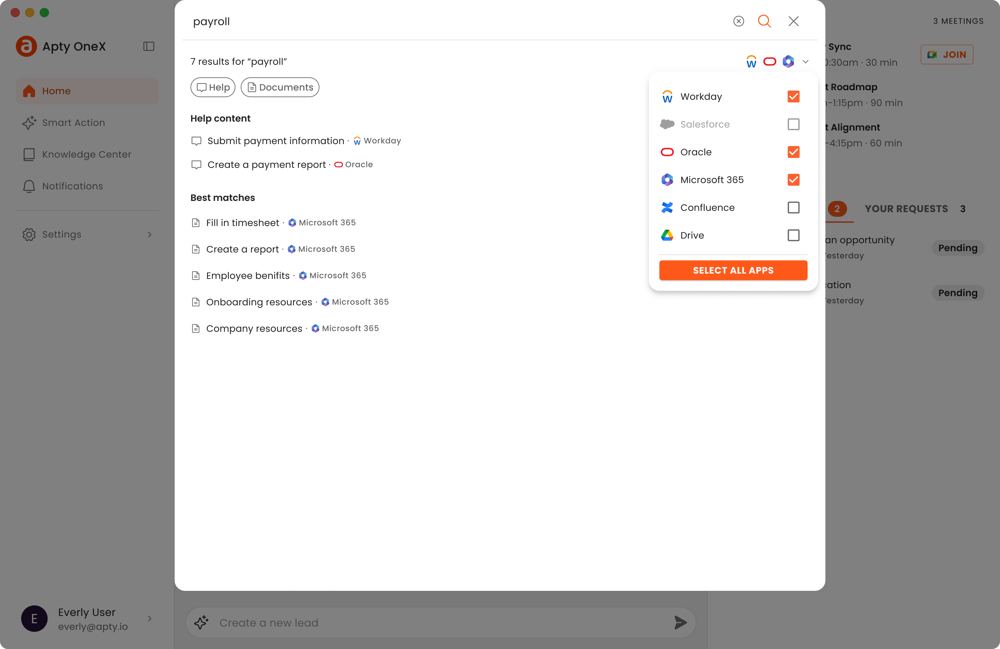

## Overview

Apty is a digital adoption platform that offers an interactive experience primarily to help enterprise customers onboard new users and help them learn new processes.


## Intro

Apty's existing solution helped customers onboard new users and improve process adoption but failed to provide much value beyond an onboarding phase. They wanted to create an MVP for a new product, OneX, to unify the existing adoption features with additional functionality to increase employee productivity.



```
– User engagement dropping after 3 to 6 months of onboarding to a new company
```

One of the new features was global search. Enterprise employees frequently need to search through several platforms to find specific documents and information. This disjointed process leads to inefficiencies and lost productivity.

## Challenge

Create a unified search feature to allow users to search across integrated services from one interface.

## Process

To allow enterprise users to search across multiple systems in their organizations, we first needed to authenticate them. I aligned with the engineering team to better understand this flow.

Users would need a way to trigger connecting a service to their account.


```
– Integrations page in OneX
```

This would launch the service in the browser where they would have to log in if they weren't already. Then they would be presented with a screen to grant permissions.


```
– Example of permissions screen in the browser
```

After that, they would be redirected to the desktop app where we would be able to display the status of the connection.


```
– Redirect screen after successeful connection
```


## Handling Errors and States

Collaboration with the engineering team was crucial to understand technical limitations and edge cases we needed to address. Since the search feature relied heavily on external parties, there was a lot that could go wrong and we needed to communicate system feedback to users in actionable ways. Some interesting cases we covered included:

Missing integrations and providing a way for users to connect a service when the search failed.


```
– Error state showing disconnected services
```

Communicating ongoing searches due to longer waiting time.


```
– Loading state for the search
```

Differentiating between search result type and providers to allow users to filter the results.



```
– Application and content type filters
```


