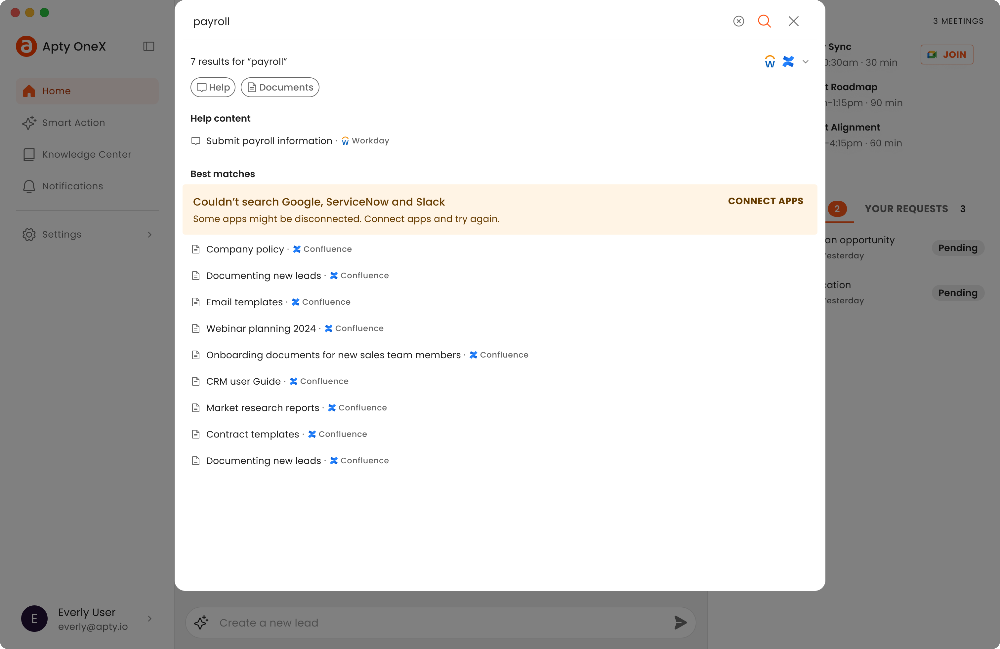
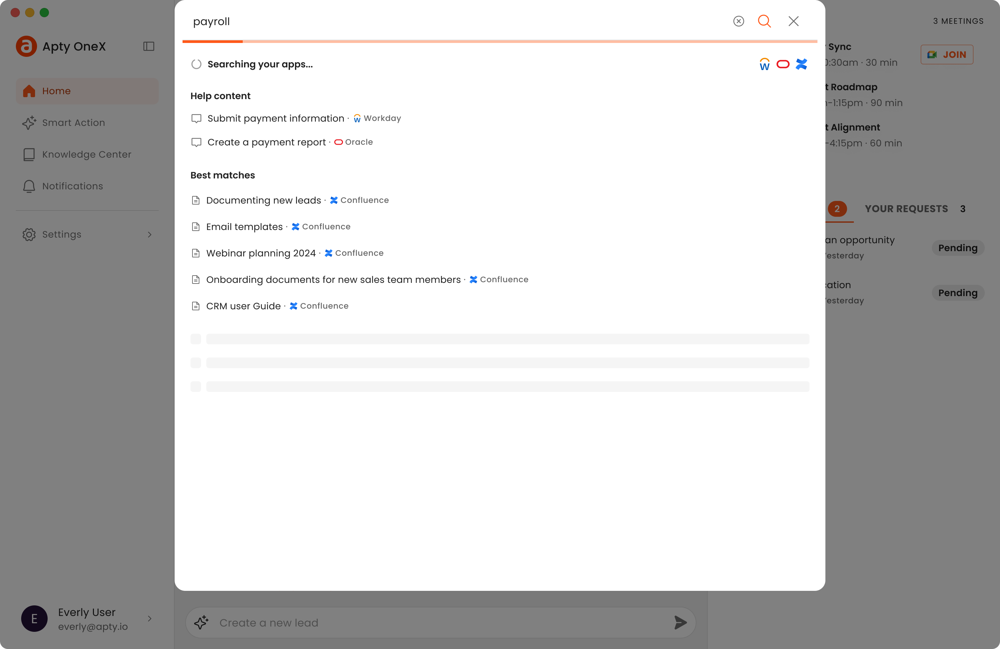

## Overview

Have you ever found yourself navigating through multiple services like Drive, Slack, and Confluence to locate specific documents or files? Trying to find information in a large organization can be time-consuming and frustrating. OneX aims to address this issue by integrating all company services into a single application, allowing end-users to perform a comprehensive search across their entire organization with one query.

## Problem

Enterprise employees frequently need to search through several platforms to find specific documents or information. This disjointed process leads to inefficiencies and lost productivity. A unified search feature within can streamline this process by enabling users to search across all integrated services from one interface.

## Goals

This feature was developed as part of an MVP for the digital adoption platform Apty. The existing product helped customers onboard new users and improve process adoption but failed to provide much value beyond that. The OneX desktop app aimed to unify the existing software and process adoption product with additional features to increase employee productivity.

> ### 🎯 Goals
>
> - Allow users to search across their organization’s services with a single query
> - Facilitate easy integration setup
> - Handle search results from different providers, ensuring relevancy and proper grouping of results
> - Adhere to established patterns and conventions for familiarity and ease of use

## Research and Discovery

This MVP was designed for enterprise employees who use multiple systems daily, typically 3 to 5, for their work-related tasks.

To better understand user needs and pain points, Apty conducted interviews and surveys with their customers. Key findings included:

> ### ⚡Insights
>
> - Users often spent time switching between platforms to find information
> - There was demand for a unified search solution
> - The existing Apty product was limited in functionality and failed to provide much value after an onboarding phase

## Solution

To allow enterprise users to search across multiple systems in their organizations, we first needed to authenticate them. I aligned with the engineers to better understand this flow.

Users would need a way to trigger connecting a service to their account.

This would launch the service in the browser where they would have to log in if they weren't already. Then they would be presented with a screen to grant permissions.

After that, they would be redirected to the desktop app where we would be able to display the status of the connection.

## Handling Errors and States

Collaboration with the engineering team was crucial to understand the technical limitations and cases we would need to address. Since the search feature relied heavily on external parties, there was a lot that could go wrong and we needed to communicate those states to the user in actionable ways. Some interesting cases we had to cover included:

Missing integrations and providing a way for users to connect a service when the search failed.

Communicating ongoing searches due to longer waiting time.

Grouping search results due to variability in speed, amount and relevancy of the results, depending on the provider.

## Learnings

Designing a global search was an opportunity for me to learn about integrating different services. The main challenges, related to system feedback,  required good collaboration with the engineering team to understand the different states and find ways to effectively communicate them to users in actionable ways.

## Next Steps

To further refine the search feature we'll be gathering feedback from a select group of customers through beta testing. We plan to analyze usage data and user feedback to identify areas for improvement.

## Conclusion

The federated search feature in OneX significantly enhances productivity by providing a seamless, unified search experience across multiple enterprise services. By focusing on user needs, following established design patterns, and collaborating closely with engineers, we developed a robust solution that simplifies information retrieval in the digital workplace.